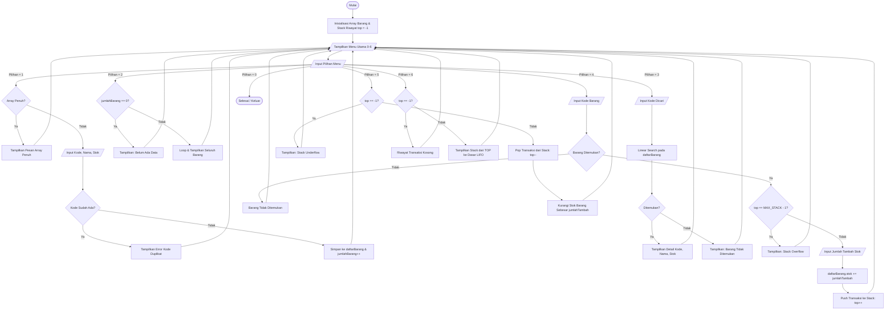
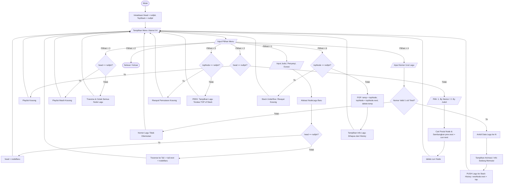

# UTS STRUKTUR DATA — HELLYOS AGENG HAQIQIE (163251001)

n **Ujian Tengah Semester (UTS)** yang mencakup duasoal:
1. **Soal 1:** Sistem Inventaris Barang Gudang *(Materi: Array + Stack)*
2. **Soal 3:** Manajemen Playlist Musik *(Materi: Singly Linked List + Stack)*

---

## 📋 Identitas Mahasiswa

| Informasi | Keterangan |
| :--- | :--- |
| **Nama** | Hellyos Ageng Haqiqie |
| **NIM** | 163251001 |
| **Mata Kuliah** | Struktur Data |
| **Tipe Soal** | NIM Ganjil (Soal 1 & Soal 3) |
| **Bahasa Pemrograman** | C++ |

---

## 📂 Struktur Direktori Proyek

```plaintext
UTS-STRUKTUR-DATA/
│
├── inventaris_gudang.cpp   # Source code Soal 1 (Array + Stack)
├── playlist_musik.cpp      # Source code Soal 3 (Singly Linked List + Stack)
├── .gitignore              # Mengabaikan file biner/kompilasi (.exe, .o)
└── README.md               # Dokumentasi lengkap, analisis, dan flowchart
```

---

## 📦 Soal 1 — Sistem Inventaris Barang Gudang
> **Materi:** Array + Stack

### 1. Deskripsi Tugas
Program inventaris gudang yang dirancang untuk mengelola stok barang dengan kapasitas maksimal **100 barang menggunakan Array**. Setiap barang memiliki data:
- **Kode Barang** (`string`)
- **Nama Barang** (`string`)
- **Jumlah Stok** (`int`)

Setiap penambahan stok yang terjadi akan dicatat ke dalam **Stack** sebagai riwayat transaksi terakhir (*Last-In, First-Out*). Pengguna dapat membatalkan penambahan stok terakhir (*Undo/Rollback*) menggunakan operasi **Pop** pada Stack.

### 2. Fitur Program
1. **Tambah Barang Baru (Array):** Menyimpan barang baru ke dalam array statis berukuran 100 dengan validasi duplikasi kode barang dan kapasitas penuh.
2. **Tampilkan Seluruh Barang:** Menampilkan tabel data semua barang yang tersimpan dalam format tabular.
3. **Cari Barang Berdasarkan Kode:** Menggunakan algoritma *Linear Search* untuk menemukan detail barang berdasarkan kode unik.
4. **Tambah Stok Barang (Push ke Stack):** Menambahkan stok barang yang dipilih dan secara otomatis mencatat riwayat transaksi ke puncak Stack (Push). Dilengkapi validasi *Stack Overflow*.
5. **Batalkan Transaksi Terakhir (Pop Stack):** Mengambil transaksi teratas dari Stack (Pop) dan membatalkan penambahan stok tersebut (*rollback* jumlah stok). Dilengkapi validasi *Stack Underflow*.
6. **Tampilkan Riwayat Transaksi:** Menampilkan seluruh riwayat perubahan stok dari urutan `TOP` ke `BOTTOM` (LIFO).

### 3. Struktur Data
- **Struct `Barang`**: Menyimpan representasi entitas barang.
- **Struct `Transaksi`**: Menyimpan riwayat perubahan stok (`kodeBarang`, `namaBarang`, `jumlahTambah`).
- **Struct `StackRiwayat`**: Implementasi stack berbasis array dengan atribut `data[MAX_STACK]` dan pointer indeks `top`.
  - Kondisi Kosong (*Empty*): `top == -1`
  - Kondisi Penuh (*Full*): `top == MAX_STACK - 1`

### 4. Flowchart Alur Program (Soal 1)



---

## 🎵 Soal 3 — Manajemen Playlist Musik
> **Materi:** Singly Linked List + Stack

### 1. Deskripsi Tugas
Aplikasi manajemen playlist lagu yang dibangun menggunakan struktur data dinamis **Singly Linked List**. Setiap lagu memiliki atribut:
- **Judul Lagu** (`string`)
- **Nama Penyanyi** (`string`)
- **Durasi** (`string`, format `MM:SS`)

Setiap lagu yang diputar berdasarkan urutannya akan secara otomatis dimasukkan ke dalam **Stack History**. Pengguna dapat melihat lagu apa yang terakhir kali diputar (*Peek*) dan menghapus riwayat pemutaran terakhir (*Pop*).

### 2. Fitur Program
1. **Tambah Lagu ke Playlist:** Menyisipkan lagu baru pada ujung akhir playlist (*Insert at End / Tail*) pada Singly Linked List.
2. **Hapus Lagu dari Playlist:** Menghapus lagu dari playlist baik berdasarkan nomor urut (posisi node) maupun berdasarkan pencarian judul lagu dengan dealokasi memori yang tepat.
3. **Tampilkan Playlist:** Melakukan traversal dari `head` hingga `nullptr` untuk menampilkan daftar putar musik lengkap.
4. **Putar Lagu Berdasarkan Urutan:** Memilih nomor urutan lagu dari playlist untuk diputar. Lagu yang sedang diputar secara otomatis di-**PUSH** ke dalam **Stack History**.
5. **Lihat Lagu Terakhir Diputar (Stack Peek):** Mengakses elemen teratas (*TOP*) pada Stack History tanpa menghapusnya, disertai opsi menampilkan seluruh jejak riwayat pemutaran.
6. **Hapus History Terakhir (Pop):** Menghapus entri pemutaran lagu paling terakhir dari Stack History (*Pop*) dengan proteksi *Stack Underflow*.

### 3. Struktur Data
- **Struct `Lagu`**: Menyimpan representasi entitas lagu (`judul`, `penyanyi`, `durasi`).
- **Struct `NodeLagu`**: Node Singly Linked List yang memiliki pointer `next` menuju lagu berikutnya.
- **Class `PlaylistMusik`**: Pengelola Singly Linked List dengan pointer `head` dan counter `totalLagu`.
- **Class `StackHistory`**: Implementasi Stack berbasis linked node (`NodeStack`) yang bekerja dinamis tanpa batasan kapasitas kaku dengan operasi:
  - `push(Lagu)`
  - `pop(Lagu&)`
  - `peek(Lagu&)`
  - `displayAll()`

### 4. Flowchart Alur Program (Soal 3)



---


---

## Testing 

| Kasus Uji | Skenario | Hasil yang Diharapkan | Status |
| :--- | :--- | :--- | :--- |
| **Array Overflow (Soal 1)** | Menambah barang ketika jumlah mencapai 100 | Menampilkan pesan kapasitas penuh dan menolak input | ✅ Lolos |
| **Stack Overflow (Soal 1)** | Menambah stok saat riwayat transaksi mencapai 100 | Menolak pencatatan riwayat dengan peringatan Stack Overflow | ✅ Lolos |
| **Stack Underflow (Soal 1)** | Membatalkan transaksi saat riwayat kosong | Menolak operasi pembatalan dengan pesan Stack Underflow | ✅ Lolos |
| **Undo / Rollback (Soal 1)** | Batalkan transaksi penambahan stok | Mengurangi kembali stok barang persis sejumlah transaksi terakhir | ✅ Lolos |
| **Delete Head / Middle (Soal 3)** | Hapus lagu nomor 1 atau nomor tengah pada Singly Linked List | Pointer terhubung kembali dengan rapi tanpa memory leak | ✅ Lolos |
| **History Push & Peek (Soal 3)** | Putar lagu nomor 1 lalu nomor 3 | Lagu terakhir diputar (nomor 3) berada pada `TOP` stack | ✅ Lolos |
| **History Pop (Soal 3)** | Hapus riwayat terakhir pada stack | Lagu di `TOP` terhapus dan digantikan oleh lagu sebelumnya | ✅ Lolos |
| **History Underflow (Soal 3)** | Pop history saat belum ada lagu diputar | Menampilkan peringatan Stack Underflow | ✅ Lolos |
